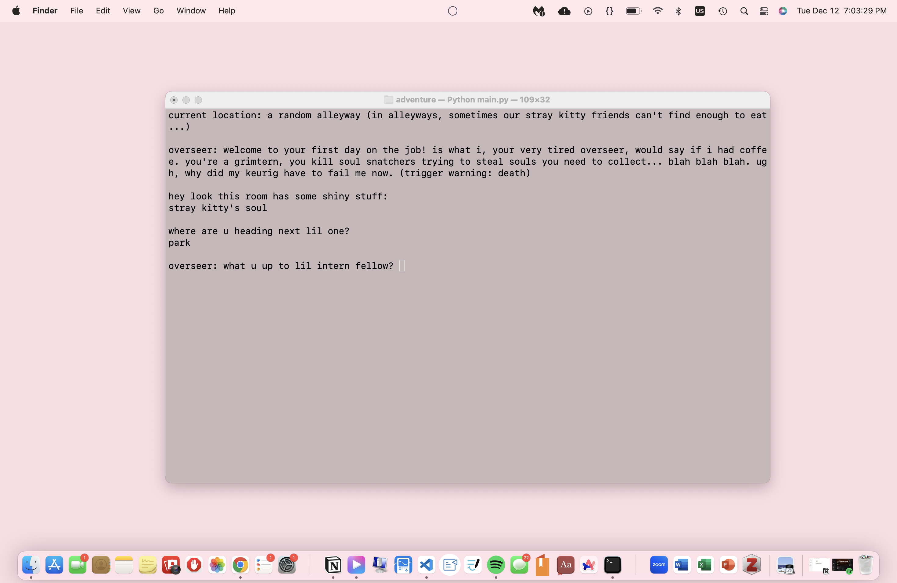
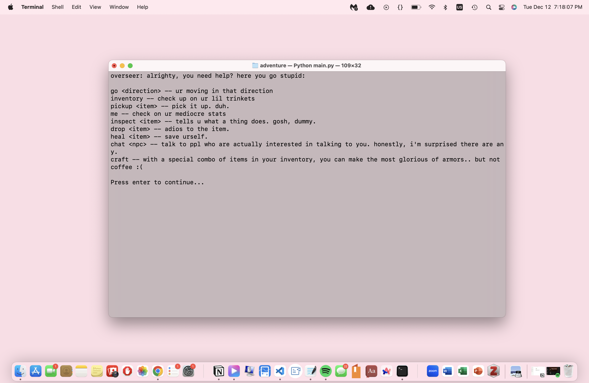

## 👩🏻‍💻 DESCRIPTION
> welcome to `grimterm 💀`, a text-based adventure game that merges the deathly with the corporate (and the nihilist)! in grimterm, you play as the grimterm (a grim-reaper-in-training intern), going around collecting both souls and eulogies, fighting off evil soul snatcher, exploring both the over- and underworld, and praying for a promotion.


⬆️ opening still of `grimterm`

## 💡 INSTRUCTIONS 

⬆️ **help** command of `grimterm`

### other details 🌟
* **the victory condition**: collecting all 5 souls, killing the final boss, agreeing to a promotion offer from the "GRIM REAPER"
* there are 6 "rooms" you travel through with the **go** command
   * the last room, the underworld, is a locked room (requires the grim hq swipe access)
* having weapons and armor in your inventory gives you automatic attack/health bonuses in fights
* inventory has a weight maximum of 30 units
* as time passes, you regenerate health (<50% of regenerating 1 hp)
* as time passes, staying in the hospital reduces your health

  
##  📦 INSTALLING AND RUNNING 
1. from [00eemsy/csci-121-projects/adventure](https://github.com/00eemsy/csci-121-projects/tree/main/adventure), download the following files:
    * `etcetera.py`
    * `item.py`
    * `main.py`
    * `monster.py`
    * `npc.py`
    * `player.py`
    * `room.py`
    * `updater.py`
2. using your preferred console, type the following:

``` 
python3 main.py 
```

## 🎮 DEMOS 

_picking up and dropping items_


_attacking soul snatchers:_


_chatting with the grim reaper:_

